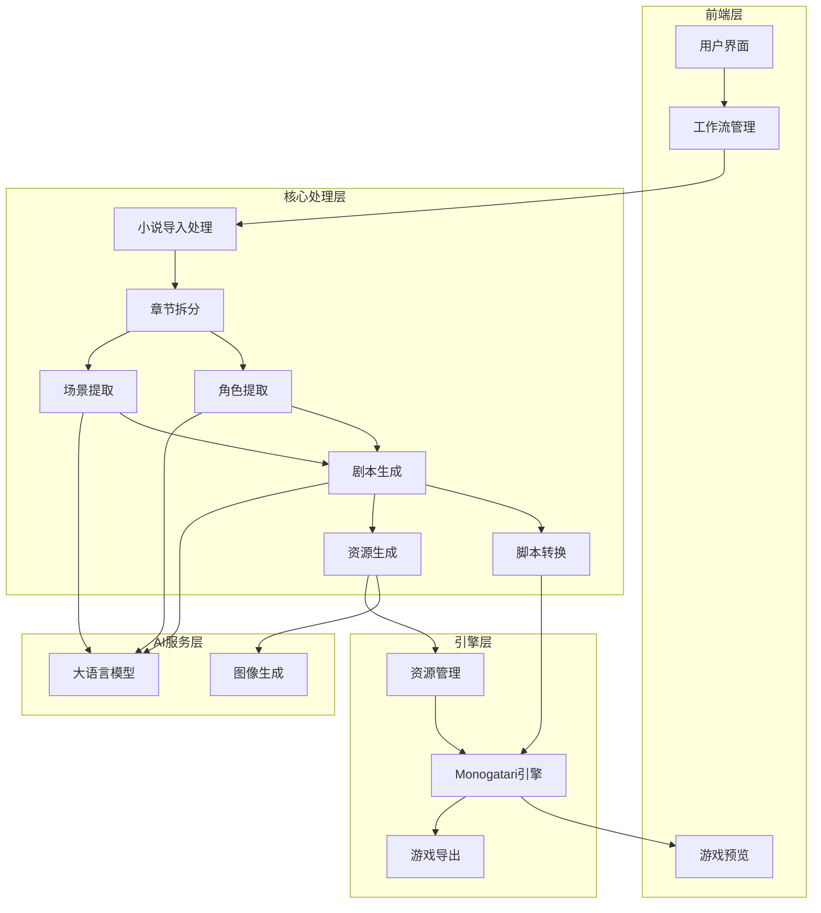

# Story Game Generator 开发文档

## 1. 项目概述

### 1.1 项目简介
Story Game Generator 是一个将小说文本自动转换为可运行的视觉小说（Visual Novel）游戏的平台。通过 AI 技术，实现从小说文本到完整游戏的全流程自动化转换。

### 1.2 核心目标
- 实现小说文本到视觉小说游戏的自动转换
- 提供用户友好的操作界面
- 确保生成游戏的质量和可玩性
- 支持多种小说格式和游戏风格

### 1.3 技术栈
- **前端**: React 19, Tailwind CSS
- **存储**: IndexedDB
- **AI**: OpenAI GPT / Anthropic Claude（通过 AntSK API）
- **游戏引擎**: Monogatari
- **图像生成**: Midjourney / Stable Diffusion

## 2. 系统架构

### 2.1 整体架构



### 2.2 模块划分

| 模块 | 主要职责 | 文件位置 |
|------|---------|----------|
| 小说导入处理 | 处理各种格式小说的导入和预处理 | `shared/utils/import.js` |
| 章节拆分 | 自动识别和拆分小说章节 | `shared/utils/chapter-splitter.js` |
| 角色提取 | 从小说中提取角色信息 | `shared/utils/character-extractor.js` |
| 场景提取 | 从小说中提取场景信息 | `shared/utils/scene-extractor.js` |
| 剧本生成 | 将小说章节转换为剧本格式 | `shared/utils/script-generator.js` |
| 脚本转换 | 将剧本转换为Monogatari脚本 | `shared/utils/converter.js` |
| 资源生成 | 生成角色和场景图像 | `tools/WL-AI-Director/src/resource-generator.js` |
| 游戏预览 | 预览生成的游戏 | `engine/monogatari/dist` |
| 游戏导出 | 导出完整的游戏 | `shared/utils/export.js` |

## 3. 功能模块详细设计

### 3.1 小说导入处理模块

#### 3.1.1 功能描述
- 支持导入TXT、PDF、EPUB等格式的小说
- 文本预处理和清洗
- 编码和格式转换

#### 3.1.2 技术实现
- 使用文件API读取本地文件
- 使用第三方库处理PDF和EPUB格式
- 文本清洗和规范化处理

#### 3.1.3 数据结构
```javascript
// 小说数据结构
const novelData = {
  id: String,           // 小说唯一标识
  title: String,        // 小说标题
  author: String,       // 作者
  content: String,      // 原始内容
  chapters: Array,      // 章节列表
  createdAt: Date,      // 创建时间
  updatedAt: Date       // 更新时间
};
```

### 3.2 章节拆分模块

#### 3.2.1 功能描述
- 自动识别章节结构
- 章节标题提取和规范化
- 章节内容组织

#### 3.2.2 技术实现
- 使用正则表达式识别章节标题
- 章节内容提取和组织
- 章节标题规范化处理

#### 3.2.3 数据结构
```javascript
// 章节数据结构
const chapterData = {
  id: String,           // 章节唯一标识
  title: String,        // 章节标题
  content: String,      // 章节内容
  order: Number,        // 章节顺序
  wordCount: Number,    // 字数
  characters: Array,    // 章节中出现的角色
  scenes: Array         // 章节中出现的场景
};
```

### 3.3 角色提取模块

#### 3.3.1 功能描述
- 从小说中提取角色信息
- 角色特征分析
- 角色关系识别

#### 3.3.2 技术实现
- 使用AI模型分析小说内容
- 提取角色名称、特征、关系
- 生成角色描述和参考提示词

#### 3.3.3 数据结构
```javascript
// 角色数据结构
const characterData = {
  id: String,           // 角色唯一标识
  name: String,         // 角色名称
  description: String,  // 角色描述
  appearance: String,   // 外貌特征
  personality: String,  // 性格特征
  relationships: Array, // 与其他角色的关系
  referencePrompt: String // 用于生成参考图的提示词
};
```

### 3.4 场景提取模块

#### 3.4.1 功能描述
- 从小说中提取场景信息
- 场景特征分析
- 场景环境描述

#### 3.4.2 技术实现
- 使用AI模型分析小说内容
- 提取场景名称、描述、环境特征
- 生成场景描述和参考提示词

#### 3.4.3 数据结构
```javascript
// 场景数据结构
const sceneData = {
  id: String,           // 场景唯一标识
  name: String,         // 场景名称
  description: String,  // 场景描述
  environment: String,  // 环境特征
  atmosphere: String,   // 氛围描述
  referencePrompt: String // 用于生成参考图的提示词
};
```

### 3.5 剧本生成模块

#### 3.5.1 功能描述
- 将小说章节转换为剧本格式
- 对话提取和组织
- 场景转换和描述

#### 3.5.2 技术实现
- 使用AI模型分析章节内容
- 提取对话和场景描述
- 组织成剧本格式

#### 3.5.3 数据结构
```javascript
// 剧本数据结构
const scriptData = {
  id: String,           // 剧本唯一标识
  chapterId: String,    // 对应章节ID
  scenes: Array,        // 剧本场景列表
  dialogue: Array,      // 对话列表
  actions: Array        // 动作描述
};
```

### 3.6 脚本转换模块

#### 3.6.1 功能描述
- 将剧本转换为Monogatari脚本格式
- 支持对话、场景、角色等元素的转换
- 脚本验证和错误检查

#### 3.6.2 技术实现
- 解析剧本结构
- 转换为Monogatari脚本语法
- 验证脚本正确性

#### 3.6.3 数据结构
```javascript
// Monogatari脚本数据结构
const monogatariScript = {
  init: Object,         // 初始化配置
  script: Array,        // 脚本内容
  images: Object,       // 图像资源配置
  characters: Object,   // 角色配置
  scenes: Object,       // 场景配置
  audio: Object         // 音频配置
};
```

### 3.7 资源生成模块

#### 3.7.1 功能描述
- 生成角色立绘和场景图
- 确保角色一致性
- 场景环境统一

#### 3.7.2 技术实现
- 使用AI图像生成模型
- 基于参考提示词生成图像
- 图像后处理和优化

#### 3.7.3 数据结构
```javascript
// 资源数据结构
const resourceData = {
  id: String,           // 资源唯一标识
  type: String,         // 资源类型（character/scene）
  name: String,         // 资源名称
  url: String,          // 资源路径
  prompt: String,       // 生成提示词
  createdAt: Date       // 创建时间
};
```

### 3.8 游戏预览模块

#### 3.8.1 功能描述
- 实时预览生成的游戏
- 支持基本的游戏操作
- 预览效果评估

#### 3.8.2 技术实现
- 集成Monogatari引擎
- 构建临时游戏环境
- 提供预览界面

### 3.9 游戏导出模块

#### 3.9.1 功能描述
- 导出完整的游戏
- 支持多种导出格式
- 优化导出文件大小

#### 3.9.2 技术实现
- 打包游戏资源
- 生成游戏配置文件
- 压缩和优化导出文件

## 4. 开发流程

### 4.1 开发环境搭建

1. **前端开发环境**
   - Node.js 18+
   - npm 或 yarn
   - React 19
   - Tailwind CSS

2. **AI服务配置**
   - AntSK API Key
   - 模型配置
   - API调用设置

3. **游戏引擎配置**
   - Monogatari引擎集成
   - 资源路径配置
   - 脚本格式设置

### 4.2 开发规范

1. **代码规范**
   - 使用ES6+语法
   - 遵循Airbnb代码风格
   - 使用TypeScript类型定义

2. **命名规范**
   - 文件名使用kebab-case
   - 变量名使用camelCase
   - 常量名使用UPPER_SNAKE_CASE
   - 组件名使用PascalCase

3. **目录结构**
   - 遵循项目现有目录结构
   - 模块分离，职责单一
   - 代码组织清晰

### 4.3 版本控制

- 使用Git进行版本控制
- 遵循Git Flow工作流
- 定期提交和分支管理

## 5. 进度管理

### 5.1 开发阶段

| 阶段 | 时间 | 主要任务 |
|------|------|----------|
| 第一阶段 | 第1-2周 | 环境搭建和基础架构 |
| 第二阶段 | 第3-6周 | 核心功能实现 |
| 第三阶段 | 第7-10周 | 功能增强和优化 |
| 第四阶段 | 第11-12周 | 测试和修复 |

### 5.2 里程碑

| 里程碑 | 完成标准 |
|--------|----------|
| 环境搭建完成 | 开发环境配置完成，项目能正常运行 |
| 小说导入功能 | 支持多种格式小说导入和预处理 |
| 章节拆分功能 | 能自动识别和拆分小说章节 |
| 角色场景提取 | 能从小说中提取角色和场景信息 |
| 剧本生成功能 | 能将小说章节转换为剧本格式 |
| 脚本转换功能 | 能将剧本转换为Monogatari脚本 |
| 资源生成功能 | 能生成角色和场景图像 |
| 游戏预览功能 | 能实时预览生成的游戏 |
| 游戏导出功能 | 能导出完整的游戏 |
| 项目完成 | 所有功能测试通过，文档完善 |

### 5.3 进度跟踪

- 使用项目管理工具跟踪进度
- 定期召开开发会议
- 每周更新开发进度
- 及时解决开发过程中的问题

## 6. 技术要求

### 6.1 前端技术

- React 19
- Tailwind CSS
- TypeScript
- IndexedDB
- File API

### 6.2 AI技术

- AntSK API
- GPT-5.1+
- Gemini 3 Pro
- Midjourney / Stable Diffusion

### 6.3 游戏技术

- Monogatari引擎
- HTML5
- CSS3
- JavaScript

### 6.4 工具和库

- 文本处理库
- PDF/EPUB处理库
- 图像处理库
- 压缩库

## 7. 测试计划

### 7.1 测试策略

- 单元测试：测试各个模块的功能
- 集成测试：测试模块间的交互
- 系统测试：测试整个系统的功能
- 性能测试：测试系统的性能和响应时间
- 用户测试：测试用户体验和操作流程

### 7.2 测试用例

| 测试用例 | 测试内容 | 预期结果 |
|----------|----------|----------|
| 小说导入测试 | 导入不同格式的小说 | 成功导入并正确处理 |
| 章节拆分测试 | 测试章节识别和拆分 | 正确识别章节并组织 |
| 角色提取测试 | 测试角色信息提取 | 正确提取角色信息 |
| 场景提取测试 | 测试场景信息提取 | 正确提取场景信息 |
| 剧本生成测试 | 测试剧本生成功能 | 生成符合要求的剧本 |
| 脚本转换测试 | 测试脚本转换功能 | 生成正确的Monogatari脚本 |
| 资源生成测试 | 测试图像生成功能 | 生成高质量的角色和场景图像 |
| 游戏预览测试 | 测试游戏预览功能 | 能正常预览游戏 |
| 游戏导出测试 | 测试游戏导出功能 | 导出完整的游戏 |
| 性能测试 | 测试系统性能 | 响应时间在可接受范围内 |

### 7.3 测试工具

- Jest：单元测试
- Cypress：端到端测试
- Lighthouse：性能测试
- Chrome DevTools：调试和性能分析

## 8. 部署方案

### 8.1 本地部署

1. **安装依赖**
   ```bash
   # 进入工具目录
   cd tools/WL-AI-Director
   npm install
   
   # 安装验证工具
   cd ../../shared/utils
   npm install
   ```

2. **启动开发服务器**
   ```bash
   # 启动AI创作工具
   cd tools/WL-AI-Director
   npm run dev
   
   # 启动游戏预览
   cd ../../engine/monogatari/dist
   python -m http.server 8080
   ```

### 8.2 生产部署

1. **构建生产版本**
   ```bash
   # 构建AI创作工具
   cd tools/WL-AI-Director
   npm run build
   
   # 构建游戏引擎
   cd ../../engine/monogatari
   npm run build
   ```

2. **部署到服务器**
   - 部署前端应用到静态网站服务器
   - 配置API密钥和环境变量
   - 测试部署后的功能

### 8.3 Docker部署

1. **构建Docker镜像**
   ```bash
   # 构建AI创作工具镜像
   cd tools/WL-AI-Director
   docker build -t story-game-generator .
   ```

2. **运行Docker容器**
   ```bash
   docker run -d -p 3000:3000 --name story-game-generator story-game-generator
   ```

## 9. 风险评估

### 9.1 技术风险

| 风险 | 影响 | 应对措施 |
|------|------|----------|
| AI模型API不稳定 | 影响生成质量和速度 | 实现API故障处理和重试机制 |
| 图像处理性能 | 影响用户体验 | 优化图像处理流程，使用异步处理 |
| 脚本转换复杂度 | 影响游戏质量 | 编写详细的转换规则和验证机制 |

### 9.2 业务风险

| 风险 | 影响 | 应对措施 |
|------|------|----------|
| 小说版权问题 | 法律风险 | 明确用户责任，添加版权声明 |
| 生成内容质量 | 用户满意度 | 提供手动编辑功能，允许用户调整 |
| 资源消耗 | 运营成本 | 优化资源使用，提供资源管理功能 |

## 10. 未来规划

### 10.1 功能扩展

- 支持更多小说格式
- 增加语音合成功能
- 添加动画效果支持
- 集成更多游戏引擎

### 10.2 技术升级

- 使用更先进的AI模型
- 优化性能和用户体验
- 支持更多语言和文化
- 开发移动应用版本

### 10.3 生态系统

- 建立资源共享平台
- 支持用户社区和协作
- 提供插件和扩展系统
- 开发教育和培训资源

## 11. 结论

Story Game Generator 是一个创新的项目，旨在通过 AI 技术将小说文本自动转换为视觉小说游戏。通过本开发文档的指导，我们将实现一个功能完整、用户友好的小说转游戏生成平台，为创作者提供从小说到游戏的一站式解决方案。

本文档将作为项目开发的指导文件，确保开发过程有序进行，最终实现项目的核心目标。